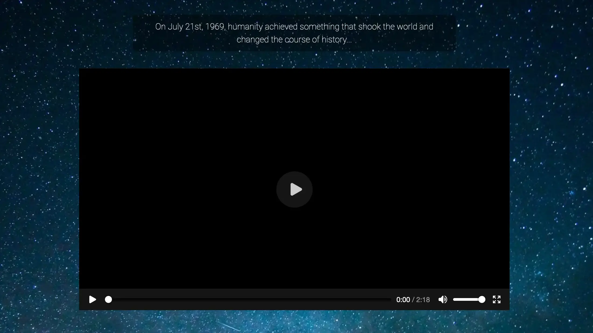
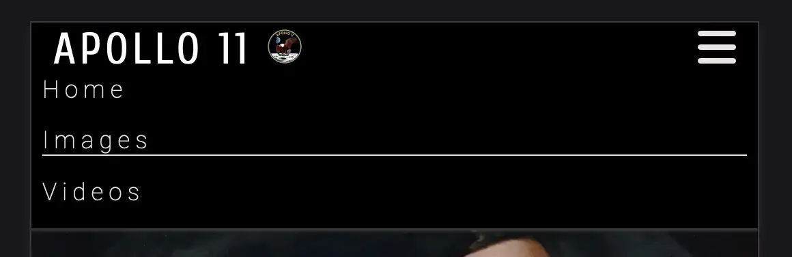

<p align="center"></p>


# Introduction
# Apollo 11
### Project Description: Apollo 11 - Mission to the Moon, is a site that aims to introduce and educate the users to the Apollo 11 mission.
### Project Purpose: The site will be targetted towards students or users looking for an easier to digest page of information.
### How it benefits the Users, Users Demographic: By focusing the information into smaller bite-size chunks and providing multimedia and links to support it. 


# Features 

**Navbar**

  - Featured on all three pages, the fully responsive navigation bar includes links to the home page, image gallery, and video gallery. It is identical on all three pages to help with navigation.
  - It will allow users to navigate between pages on all devices without needing to use the 'back' button.

  <details><summary>Navbar Screenshot</summary>

  <p align="center"></p>

  </details>

<hr> 

**Landing Page**

  - Includes an introductionary text and an embedded video to instantly introduce the user to the page's content and focus their attention.

  <details><summary>Landing Page Screenshot</summary>

  <p align="center"></p>

  </details>

<hr> 

**The Timeline Section**

  - The Timeline provides a step-by-step guide of the Apollo 11 mission. From the formation through to the success.
  - It is structured with text and supporting images of the mission at the relevant stage of its timeline.
  - This section is valuable to the user as it provides the core content of the page.

  <details><summary>Timeline Screenshot</summary>

  <p align="center"></p>

  </details>

<hr> 

**Images Page**

  - The images page showcases a variety of photographs from the Apollo 11 mission.
  - This section is valuable to the user as they will be able to see genuine historical photographs from the event they are learning about and adds context to the content.  

  <details><summary>Images Screenshot</summary>

  <p align="center"></p>

  </details>

<hr> 

**Videos Page**

  - The video page includes embedded videos on the Apollo 11 mission. 
  - It provides more context for the information on the home page as well as providing a more in-depth look into the mission. 

  <details><summary>Video Section Screenshot</summary>

  <p align="center"></p>

  </details>

<hr> 

**The Footer**

  - The footer section includes links to the Apollo 11 NASA homepage as well as to all of NASA's social networks.  
  - The footer is valuable to the user as it allows them to continue their learning into Apollo 11, as well as a chance to join communities that share the same interest as them.

  <details><summary>Footer Screenshot</summary>

   <p align="center"></p>

  </details>

<hr> 


## Future Features
While the current version of the project is fully functional, I have some features planned for future updates that I didn't have time to implement in this release.

1. **Interactive Images**:
   - As users hover over the images on the Images Page their scale will increase causing them to pop off the page and a text overlay giving more context on the photo will appear. 
   - Clicking the photos will also take the user to the image source page on the official NASA webpage.
2. **Astronaut Page**:
   - Create a page to provide a historical bakground on the astronauts of the Apollo 11 mission. Provide images and media to further increase the content of the information as well as links to relevant pages on the astronauts.
3. **NASA Page**:
   - Create a page detailing the historical timeline of NASA from the origin of the Apollo programme up to the launch of Apollo 11. Provide details on the previous Apollo missions and how they affected the overall success of Apollo 11, with multimedia and links to support it.
4. **Audio Link**:
   - Include a controllable audio link on all the pages that allow the users to listen to the countdown of Apollo 11 as well as chatter between the astronaut and mission control to create ambient background noise as they explore the webpage.
5. **Interactive Moon**:
   - Using NASA's official - Eyes on the Solar System map, create a page that allows the user to explore the moon via an interactive control panel.

<hr>

## Manual Testing 

#### Features Testing

|  Feature |  Action | Effect |
|---|---|---|
|Logo|Click|Brings back to Home page|
|Navbar Links|Click on Images|Opens Images page|
||Click on Videos|Opens Videos page|
|Video Links|Click Intro Video|Plays
||Click Intro Video Expand Button|Video expands to fullscreen
||Click CBS Youtube Video|Plays
||Click CBS Youtube Video Link|Youtube Video source page opens in a new tab
||Click CBS Youtube Video Expand Button|Video expands to fullscreen
||Click HD launch Video|Plays
||Click HD Launch Video Expand Button|Video expands to fullscreen
||Click LRO Landing Video|Plays
||Click LRO Landing Video Expand Button|Video expands to fullscreen
||Click Quote Video|Plays
||Click Quote Video Expand Button|Video expands to fullscreen
||Click Moonwalk Montage Video|Plays
||Click Moonwalk Montage Video Expand Button|Video expands to fullscreen
||Click Documentary Video|Plays
||Click Documentary Video Expand Button|Video expands to fullscreen
|Footer|Click NASA link|Nasa Apollo 11 homepage opens in a new tab|
||Click Facebook link|NASA's official Facebook page opens in a tab|
||Click X link|NASA's official X page opens in a tab|
||Click Instagram link|NASA's official Instagram page opens in a tab|
||Click Youtube link|NASA's official Youtube page opens in a tab|

<hr>

#### Lighthouse

**Introduction**
- This report presents the results of Lighthouse testing conducted to assess the performance, accessibility, best practices, SEO, and PWA compliance of Apollo 11 - Mission to the Moon.

**Test Execution**
- Lighthouse tests were executed using the PageSpeed Insights webpage. [PageSpeed Insights Webpage](https://pagespeed.web.dev/)

**Test Metrics**

Inspections | Mobile Performance | Desktop Performance |
|----------------------|--------------------|--------------------|
| Performance Score: | 72 | 94 |
| Accessibility score: | 100 | 100 |
|Best Practices Score: | 96 | 96 |
| SEO Score: | 100 | 100 |

**Detailed Results**
- **Performance**: The website's performance score is 72 on mobile, indicating good overall performance. However, there is room for improvement, particularly in load speed.

- **Accessibility**: With a score of 100 on accessibility, The webpage excels in accessibility. This indicates strong adherence to accessibility standards with minimal accessibility issues detected.

- **Best Practices**: The website follows best practices with a score of 96. A console log error being the main concern.

- **SEO**: SEO performance is strong, with a score of 100. The website has well-optimized meta tags and structured data markup.

**Areas for Improvement**
- Performance can be improved by optimizing page loading by enhancing the images on the webpage, particularly by properly sizing them.

- Will continue to maintain and update meta tags and structured data markup as I provide future updates to ensure strong SEO performance.

**Visuals**

**Mobile**
<p align="center"></p>

**Desktop**
<p align="center"></p>
<hr>

#### Browsers

**Supported Browsers and Devices**
The web application is tested and supported on the following browsers and devices:
- Mozilla Firefox (latest version)
- Google Chrome (latest version)

**Responsiveness Testing**
I conducted manual responsiveness testing on Firefox and Chrome to ensure a seamless user experience across a variety of different screen sizes.

**Test Results**

| Device/Screen Size  | Firefox Performance | Chrome Performance |
|----------------------|--------------------|---------------------|
| Desktop (1920x1080) | No visual responsiveness issues | No visual responsiveness issues |
| Laptop (1366x768)   | No visual responsiveness issues | No visual responsiveness issues |
| Tablet (768x1024 - iPad)       | No visual responsiveness issues | No visual responsiveness issues |
| Mobile (375x812 - iPhone 11 Pro)   | No visual responsiveness issues | No visual responsiveness issues |

**Recommendations**
- If you encounter any responsiveness issues, we recommend:
  - Updating your browser to the latest version.
  - Trying an alternative device or screen size for optimal viewing.

<hr>

#### Screen Sizes testing

**Introduction**
This section provides an overview of how web Apollo 11 - Mission to the moon performs across different screen sizes. It was designed and implemented across various screen sizes whilst in develepment.

| Screen Size     | Description             |
|-----------------|-------------------------|
| Desktop         | 1920x1080 pixels        |
| Laptop          | 1366x768 pixels         |
| Tablet (iPad)   | 768x1024 pixels (portrait) and 1024x768 pixels (landscape) |
| Mobile (iPhone) | 375x812 pixels (iPhone 11 Pro, portrait) and 812x375 pixels (iPhone 11 Pro, landscape) |

**Testing Results**

| Screen Size     | Firefox performace     | Chrome Performance    |
|-----------------|------------------------|-----------------------|
| Desktop         | No visual or performance issues | Slight delay in image load times
| Laptop          | No visual or performance issues | Slight delay in image load times
| Tablet (iPad)   | No visual or performance issues | Slight delay in image load times
| Mobile (iPhone) | Slight delay in embedded video load times | Slight delay in image load times

<hr> 

#### Bugs Resolved


**Introduction**
This section provides a summary of bugs that have been identified, reported, and subsequently resolved in [Website Name].

**Bug Tracking**
Below is a summary of resolved bugs:

| Bug ID | Bug Description | Status |
|--------|-----------------|--------|
| #001   | The .active class to create an underline on the page the user is currently on whilst on mobile and tablet devices wasn't contained to the desired content and stretched across the whole container. Created an ugly visual bug whenever the drop down menu was selected. | Resolved |
| #002   | Describe the bug and its impact on the user experience. | Resolved |
| #003   | Describe the bug and its impact on the user experience. | Resolved |
| #004   | Describe the bug and its impact on the user experience. | Resolved |
| #005   | Describe the bug and its impact on the user experience. | Resolved |

**Bug Details**
Here are the details of the resolved bugs:

**Bug #001**
- **Description**: The underline would stretch across the whole navbar section when the dropdown menu was opened. Can recreate it by removing the width property on the .active class in the CSS stylesheet.
- **Resolution**: I gave the .active class a width propety with a value of fit content. 

```css
.active {
  border-bottom: 1px solid #eee3e3;
  width: fit-content;
}
```
<details><summary>Navbar Bug</summary>

   <p align="center"></p>

  </details>

<hr>

- **Impact**: Whilst only a visual impact, it was distracting and would lessen the overall user engagement and enjoyment of the webpage.

**Bug #002**
- **Description**: Describe the bug and the steps to reproduce it.
- **Resolution**: Explain how the bug was resolved, including any code changes or fixes.
- **Impact**: Discuss the impact of this bug on users and the importance of the fix.

**Bug #003**
- **Description**: Describe the bug and the steps to reproduce it.
- **Resolution**: Explain how the bug was resolved, including any code changes or fixes.
- **Impact**: Discuss the impact of this bug on users and the importance of the fix.

**Bug #004**
- **Description**: Describe the bug and the steps to reproduce it.
- **Resolution**: Explain how the bug was resolved, including any code changes or fixes.
- **Impact**: Discuss the impact of this bug on users and the importance of the fix.

**Bug #005**
- **Description**: Describe the bug and the steps to reproduce it.
- **Resolution**: Explain how the bug was resolved, including any code changes or fixes.
- **Impact**: Discuss the impact of this bug on users and the importance of the fix.

<hr>

#### Validator Testing 
- HTML
  - No errors were returned when passing through the official [W3C validator](https://validator.w3.org/nu/?doc=https%3A%2F%2Fcode-institute-org.github.io%2Flove-running-2.0%2Findex.html)
- CSS
  - No errors were found when passing through the official [(Jigsaw) validator](https://jigsaw.w3.org/css-validator/validator?uri=https%3A%2F%2Fvalidator.w3.org%2Fnu%2F%3Fdoc%3Dhttps%253A%252F%252Fcode-institute-org.github.io%252Flove-running-2.0%252Findex.html&profile=css3svg&usermedium=all&warning=1&vextwarning=&lang=en#css)


## Deployment

This section should describe the process you went through to deploy the project to a hosting platform (e.g. GitHub) 

- The site was deployed to GitHub pages. The steps to deploy are as follows: 
  - In the GitHub repository, navigate to the Settings tab 
  - From the source section drop-down menu, select the Main Branch
  - Once the main branch has been selected, the page will be automatically refreshed with a detailed ribbon display to indicate the successful deployment. 

The live link can be found here - https://code-institute-org.github.io/love-running-2.0/index.html 


## Credits 

In this section you need to reference where you got your content, media and extra help from. 
It is common practice to use code from other repositories and tutorials, however, it is important to be very specific about these sources to avoid plagiarism. 

You can break the credits section up into Content and Media, depending on what you have included in your project. 

#### Content 

- The text for the Home page was taken from Wikipedia Article A
- The development of this project was aided by the following YouTube tutorials:

| Tutorial Title      | Creator/Channel Name | Description                                          |
|---------------------|-----------------------|------------------------------------------------------|
| [Tutorial Title 1](link-to-tutorial) | [Creator/Channel Name 1] | How this tutorial helped you.             |
| [Tutorial Title 2](link-to-tutorial) | [Creator/Channel Name 2] | How this tutorial contributed to your project. |

- The icons in the footer were taken from [Font Awesome](https://fontawesome.com/)

#### Media

The following images used in this project are sourced from Unsplash and are used under their respective licenses: